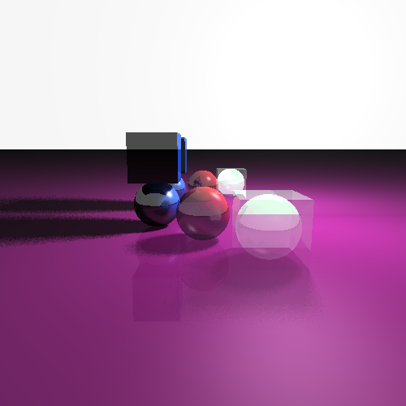

# Python Ray Tracer

Ray tracer built for Tel Aviv University's Computer Graphics course (2025).

Implements Phong shading, soft shadows, reflections, transparency, and supersampling — vectorized with NumPy.

## Sample output




## Run

```bash
pip install numpy pillow
python ray_tracer.py <scene_file> <output.png> [--width 500] [--height 500]
```

Scene files live in `scenes/`.

## Status

Coursework project. Not maintained — provided as-is.
